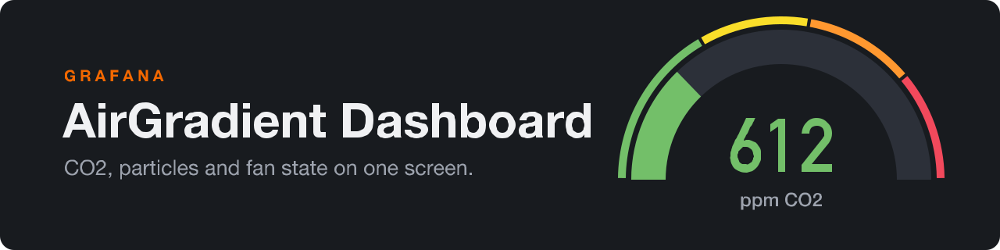

<p align="center">
  
</p>

<h1 align="center">Grafana AirGradient Dashboard</h1>

<p align="center"><a href="LICENSE"></a></p>

Grafana dashboard for the [AirGradient ONE](https://www.airgradient.com/indoor/) air quality monitor, fed from [Home Assistant](https://www.home-assistant.io/) through Prometheus, with the state of a bathroom extractor fan on the same timeline.

## Features

- CO2 gauge and time series with green, yellow, orange and red thresholds.
- PM2.5 gauge with bands at 5, 12, 35, 55 and 125 ug/m3, the first being the WHO annual guideline.
- VOC and NOx index gauges and time series.
- Temperature and humidity stat panels with sparklines and time series.
- PM1, PM2.5 and PM10 on one chart, and a PM0.3 particle count.
- Extractor fan state timeline, and the fan's physical switch input.
- CO2 and fan state overlaid, so a ventilation event shows against the CO2 drop.

## Quick start

```bash
curl -s -X POST "http://YOUR_GRAFANA:3000/api/dashboards/db" -u "admin:YOUR_PASSWORD" -H "Content-Type: application/json" -d @dashboard.json
```

Needs an AirGradient ONE in Home Assistant with the [Prometheus integration](https://www.home-assistant.io/integrations/prometheus/) on, and a Grafana Prometheus datasource scraping it. Then edit the `entity` filters and the datasource UID as [Usage](docs/usage.md) explains; provisioning from a file is there too.

## Documentation

- [Usage](docs/usage.md): the entities each panel expects, the datasource UID, provisioning

## License

[GPL-3.0-or-later](LICENSE)
